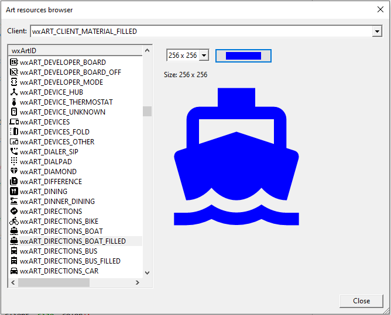

# Material Design icons Art Provider for wxWidgets

This project contains a custom Art Provider for the wxWidgets containing all Material Design icons. 

Icons were originally taken from:
* [SVG Material Design](https://github.com/marella/material-design-icons)
* [SimpleIcons](https://github.com/simple-icons/simple-icons/tree/develop)
* [FontAwesome 6.4](https://github.com/FortAwesome/Font-Awesome)
* [FluentUI icons](https://github.com/microsoft/fluentui-system-icons)

Headers are generated with the help of this IMCOMPLETE [script](scripts/create_folder_headers.py).

# Building, Using

Install CMake.

Inside this repository, use this command SYNTAX:

```bash
$ cmake -B <any build folder you want, no need to be precreated>
        -D<option>=<value>
```

Each icon types (Material Design, Simple Icons etc) are **only** available if you tell CMake to do so.

Use these `boolean` options - set to `ON` - they are all turned off by default:

* `ADD_AWESOME_ART`: Add FontAwesome.
* `ADD_MDESIGN_ART`: Add Material Design.
* `ADD_SIMPLE_ART`: Add Simple Icons.
* `ADD_FLUENTUI_ART`: Add FluentUI.

To add the `wxMaterialDesignArtProvider` class to your project, 
just register it with the default art provider as: 

```c++
    // Register art provider
    wxArtProvider::Push(new wxMaterialDesignArtProvider);
```

So that the new art IDs can be used. For each material design icon, an art ID is registered with the following pattern: 

```c++
   wxART_ICONNAME
```
where `iconname` is the name of the icon. The same names are available under five different clients, each of them corresponds to a different dataset: 

*** Material Design 
- `wxART_CLIENT_MATERIAL_FILLED` for filled icons;
- `wxART_CLIENT_MATERIAL_OUTLINE` for outlined icons;
- `wxART_CLIENT_MATERIAL_ROUND` for round icons;
- `wxART_CLIENT_MATERIAL_SHARP` for sharp icons;
- `wxART_CLIENT_MATERIAL_TWOTONE` for two-tone icons;

*** FontAwesome 6
- `wxART_CLIENT_AWESOME_BRANDS` for brand logos;
- `wxART_CLIENT_AWESOME_SOLID` for solid-style icons;
- `wxART_CLIENT_AWESOME_REGULAR` for regular icons;

*** SimpleIcons
- `wxART_CLIENT_SIMPLE_ICONS`;

*** FluentUI
- `wxART_CLIENT_FLUENTUI_REGULAR`
- `wxART_CLUENT_FLUENTUI_FILLED`.

# Colors

`wxMaterialDesignArtProvider` supports additional methods to provide the icons with a custom color. Color-based inputs are not available in the core `wxArtProvider` API, 
so to use them, it is necessary to call them directly from the `wxMaterialDesignArtProvider` class. They're all static methods: no need to instantiate an art provider anywhere. 
The color is provided as a `wxColour` additional input to the standard APIs, and resolves to `wxBLACK` if none is provided. For example, a generic art provider call with a color input will look like: 

```c++
    wxBitmap bmp;
    if (wxMaterialDesignArtProvider::HasClient(client)) {
        // Use Material Design API
        bmp = wxMaterialDesignArtProvider::GetBitmap(id, client, size, color);
    } else {
        // Use default art provider (includes overrides, if present)
        bmp = wxArtProvider::GetBitmap(id, client, size);
    }
```

The attached project contains a sample icon browser, modelled on wxWidget's standard one, and can be used to navigate all art names and styles: 




### License

- FontAwesome icons from the FontAwesome 6 SVG set are subject to the CC BY 4.0 License.
- Material Design icons are subject to the Apache 2.0 license.
- SimpleIcons are subject to  the CC0 1.0 License.
- FluentUI icons are subject to the MIT License.

This provider is released under the Apache 2.0 license, that all dataset licenses should get along with.

